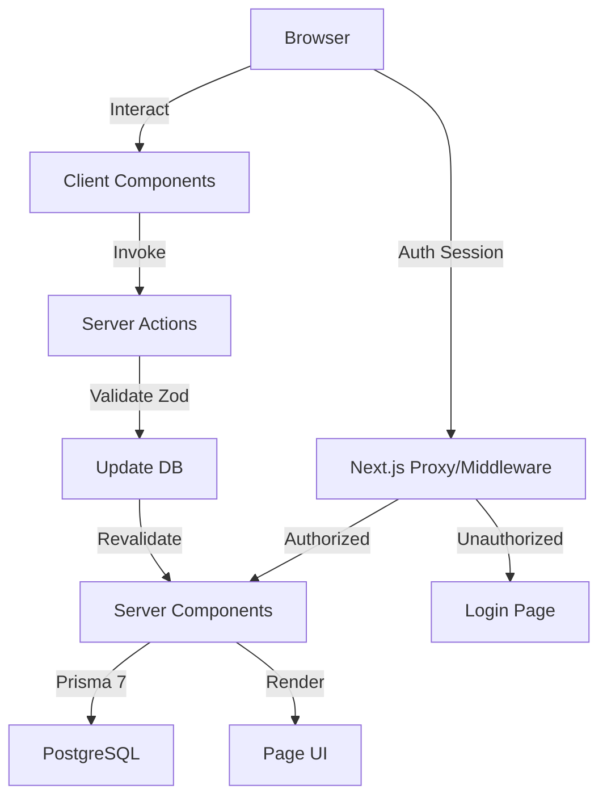

# System Architecture

## Overview
The system follows a modern full-stack architecture optimized for high scalability, security, and multi-tenant isolation.

## Technical Stack
- **Frontend/Backend**: Next.js 16 using the App Router.
- **ORM**: Prisma 7 with PostgreSQL Driver Adapters.
- **Auth**: NextAuth v5 with JWT session strategy and Prisma Adapter.
- **Styling**: Tailwind CSS with custom glassmorphism utilities.
- **Infrastructure**: Designed for edge-ready deployment (Vercel/Node.js).

## Multi-Tenancy Strategy
We use a **Shared Database, Shared Schema** approach with hard-enforced logical isolation:
- `tenantId` is present in almost all core models (`Student`, `User`, `AuditLog`, `Branch`).
- Every Prisma query in the Server Components and Server Actions strictly includes `where: { tenantId: session.user.tenantId }`.

## Component Hierarchy
- **Server Components**: Handle direct data fetching from the database via Prisma.
- **Client Components**: Handle interactive UI states (forms, tables, search, toasts).
- **Server Actions**: Handle state-changing operations with built-in auth and isolation checks.

## Data Flow

## Security & Compliance
- **Aadhaar Masking**: Logic implemented at the model and presentation layers (e.g., `XXXX-XXXX-1234`).
- **Audit Logs**: Every write operation (`registerStudent`, `savePreferences`, `uploadDocument`) triggers a synchronous `AuditLog` entry.
- **Session Context**: The `tenantId` is baked into the JWT, ensuring it cannot be spoofed client-side for data access.
