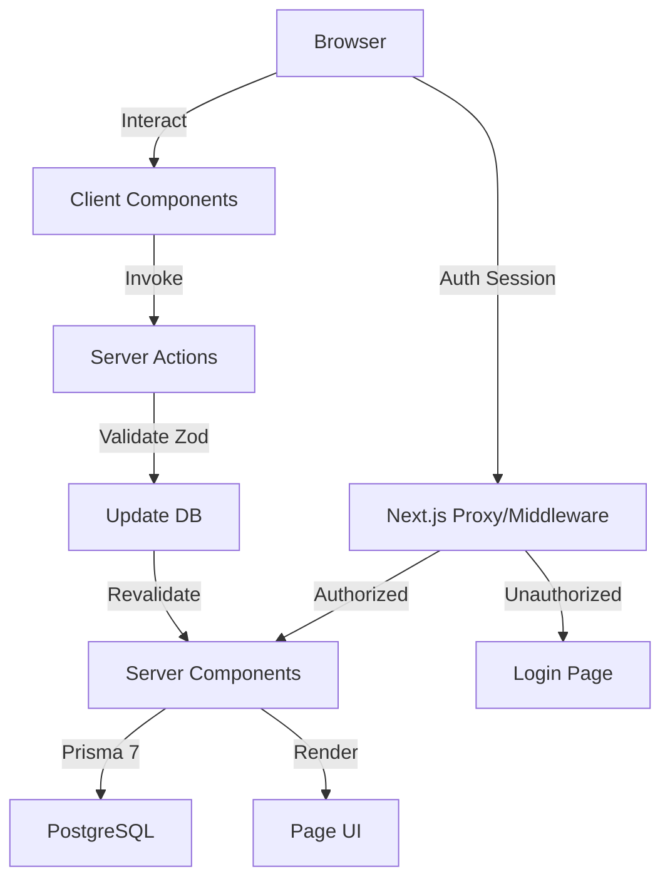

# Developer Guide — AME.HUB

This comprehensive guide covers architecture, project structure, components, mock services, data models, and testing.

---

## 🏗️ Architecture

### Technical Stack
- **Frontend/Backend**: Next.js 15 using the App Router.
- **ORM**: Prisma 7 with PostgreSQL Driver Adapters (future).
- **Auth**: NextAuth v5 with JWT session strategy.
- **Styling**: Tailwind CSS with custom glassmorphism utilities.
- **Infrastructure**: Designed for edge-ready deployment (Vercel/Node.js).

### Multi-Tenancy Strategy
We use a **Shared Database, Shared Schema** approach with hard-enforced logical isolation:
- `tenantId` is present in almost all core models.
- Every query strictly includes `where: { tenantId: session.user.tenantId }`.

### Component Hierarchy
- **Server Components**: Handle direct data fetching.
- **Client Components**: Handle interactive UI states.
- **Server Actions**: Handle state-changing operations with auth checks.

### Data Flow


---

## 📂 Project Structure

```
src/
├── app/                    # Next.js App Router
│   ├── portal/             # Role-based routes (student, staff, head, admin)
│   ├── api/                # API routes
│   └── login/              # Public login page
├── components/
│   ├── ui/                 # Shadcn/UI primitives
│   ├── layout/             # Sidebar, Navbar, MainLayout
│   ├── forms/              # Form components
│   └── onboarding/         # Tour, Help panel
├── modules/
│   ├── students/           # Student profiles, workflows
│   ├── documents/          # Document slots
│   ├── counseling/         # Sessions, colleges
│   ├── payments/           # Transactions
│   ├── branches/           # Multi-branch management
│   └── analytics/          # Metrics, KPIs
├── store/                  # Zustand state management
├── types/                  # TypeScript definitions
├── hooks/                  # Custom React hooks
└── utils/                  # Helpers & validation
```

---

## 🧩 Component Library

### Base Components (Shadcn/UI)

#### Button
```tsx
<Button variant="default">Default</Button>
<Button variant="destructive">Delete</Button>
<Button variant="outline">Cancel</Button>
```
**Variants**: `default`, `destructive`, `outline`, `secondary`, `ghost`, `link`

#### Card
```tsx
<Card className="glass">
    <CardHeader>
        <CardTitle>Title</CardTitle>
        <CardDescription>Description</CardDescription>
    </CardHeader>
    <CardContent>Content</CardContent>
</Card>
```

### Custom Components

#### StatusBadge
```tsx
<StatusBadge variant="pending">Pending</StatusBadge>
<StatusBadge variant="verified">Verified</StatusBadge>
<StatusBadge variant="rejected">Rejected</StatusBadge>
```

#### Timeline
```tsx
<Timeline steps={steps} orientation="vertical" />
<CounselingRoundTimeline rounds={rounds} />
```

#### Empty States
```tsx
<NoStudentsFound onAdd={() => router.push("/students/add")} />
<NoSearchResults query={searchTerm} />
<ErrorState onRetry={refetch} />
```

### Layout Components
- **MainLayout**: Wraps authenticated pages with Sidebar and Navbar.
- **Sidebar**: Navigation with collapsible state.
- **Navbar**: Top navigation with search, notifications, user dropdown.
- **BranchSwitcher**: Admin-only component for switching branches.

---

## 🔧 Mock Services

### Architecture
AME.HUB runs on a purely reactive mock data engine. Portals derive data from modules in `src/modules/`, bound by a Branch-Based (B/B) permissions model.

### Data Modules
| Entity | Count | Description |
|--------|-------|-------------|
| Students | 100+ | Lifecycle states (Verified, Counseling, Allotted) |
| Staff | 100+ | Branch Staff, scoped to branches |
| Heads | 100+ | Branch Heads with regional oversight |
| Documents | 8 slots | Status tracking (Uploaded, Rejected, Verified) |
| Payments | - | Simulated fee structures with transaction history |

### Using Mock Services
```typescript
import { mockStudentService } from "@/lib/mock";

// Get all students
const result = await mockStudentService.getAll({ 
    status: "REGISTERED",
    branchId: "branch-latur"
});

// Create new student
const newStudent = await mockStudentService.create({
    name: "John Doe",
    neetScore: 550
});
```

### Available Services
- **mockStudentService**: CRUD for students
- **mockUserService**: Login/logout
- **mockCounselingService**: Colleges and preferences
- **mockDocumentService**: Upload and verification
- **mockPaymentService**: Transactions
- **mockAnalyticsService**: Dashboard stats

### Async Behavior
- **Normal operations**: 100-400ms random delay
- **Auth operations**: 500ms fixed
- **File uploads**: 1000ms fixed
- **Error simulation**: 10% failure rate on create/update

### Switching to Real API
```typescript
// Mock
const data = await mockStudentService.getAll();

// Real API
const data = await fetch("/api/students").then(r => r.json());
```

---

## 📊 Data Models

### Student
```typescript
interface Student {
  id: string;
  name: string;
  email: string;
  phone: string;
  category: Category;      // General, OBC, SC, ST, EWS
  neetDetails: NEETDetails;
  status: WorkflowStatus;  // inquiry...enrollment
  assignedBranchId: string;
  documents: DocumentSlot[];
  payments: PaymentRecord[];
}
```

### Document Slot
```typescript
interface DocumentSlot {
  id: string;
  type: DocumentType;      // aadhaar, neet_scorecard, etc.
  status: 'empty' | 'uploaded' | 'verified' | 'rejected';
  fileUrl?: string;
  rejectionReason?: string;
}
```

### User
```typescript
interface User {
  id: string;
  name: string;
  email: string;
  role: 'admin' | 'staff' | 'student' | 'head';
  branchId?: string;
}
```

---

## ✅ Conventions

### Naming
- **Components**: PascalCase (`StudentCard.tsx`)
- **Hooks**: camelCase with `use` prefix (`useBranchStore.ts`)
- **Utils**: camelCase (`formatDate.ts`)
- **Test files**: `*.test.tsx` or `*.test.ts`

### Styling
- Use Tailwind utility classes
- Custom classes in `globals.css`
- Use `cn()` helper for conditional classes
- Glassmorphic design: `.glass`, `.glass-card`

### Testing Selectors
Always add `data-testid` for automation:
```tsx
<button data-testid="submit-button">Submit</button>
<table data-testid="students-table">...</table>
```

---

## 🧪 Testing

### Run Tests
```bash
npm run test
# or
npx vitest --run
```

### Current Test Suite
| Category | Status | Coverage |
|----------|--------|----------|
| Routing | ✅ Green | 100% Core Portals |
| B/B Model | ✅ Green | Branch Data Binding |
| UI/Layout | ✅ Green | Unified MainLayout |

### Test Cases
1. **Auth Flow**: Hub redirection, Admin access, Branch binding.
2. **Role Routing**: Role scoping, Portal isolation.

---

## 🔒 Security & Compliance

### DPDPA 2023 Compliance
- **Explicit Consent**: Digital consent during registration.
- **Aadhaar Masking**: Masked format `XXXX-XXXX-1234`.
- **Audit Logs**: Every action logged with timestamp.
- **Right to Erasure**: 72-hour compliance window.

### Security Measures
- **Encryption at Rest**: AES-256 encryption (DB-level).
- **Transit Security**: HTTPS/TLS.
- **Role-Based Access**: Strict RBAC for PII access.

---

## 🔗 Resources
- [Next.js Docs](https://nextjs.org/docs)
- [Tailwind CSS](https://tailwindcss.com/docs)
- [Shadcn/UI](https://ui.shadcn.com)
- [Vitest](https://vitest.dev)
